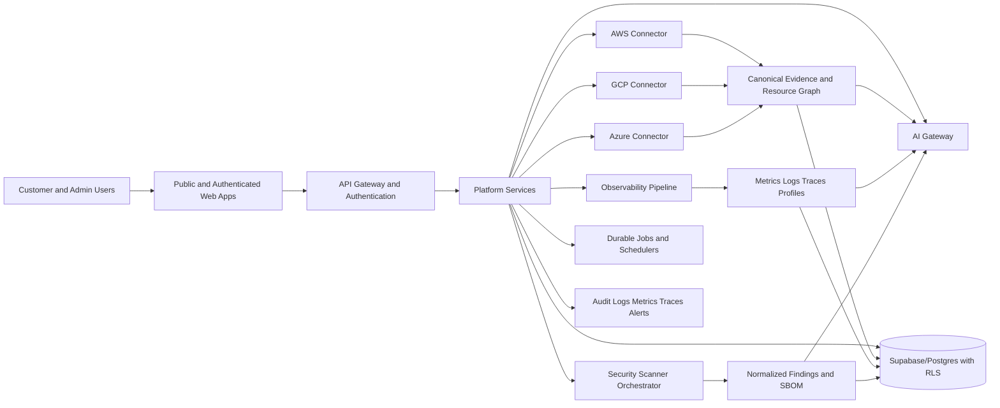

# HorizonVigil Architecture

## System overview

## Trust boundaries

- Browser to API: untrusted input; validate JWT, organization, role, scope, schema and rate limits.
- Tenant boundary: enforced in API queries and database RLS. Organization identifiers from clients are never trusted alone.
- Cloud boundary: short-lived assumed identities, tenant-unique external IDs, least privilege and account identity validation.
- Admin boundary: separate domain, authentication, roles, audit, session policy and privileged-action approval.
- AI boundary: evidence retrieval and tool calls use the caller's effective tenant and permission context.
- Scanner boundary: customer targets and artifacts are untrusted; isolate compute, filesystem, credentials and egress.

## Canonical data flow

1. Validate tenant and entitlement.
2. Resolve an encrypted credential reference or short-lived cloud identity.
3. Start an idempotent durable collection or scan run.
4. Collect paginated evidence with explicit partial failures.
5. Normalize identity, relationships, lineage, timestamps and capability state.
6. Persist through tenant-scoped APIs and RLS.
7. Materialize cost, security, compliance, change or observability views.
8. Ground AI and recommendations in cited stored evidence.
9. Record decisions, approvals and outcomes immutably.
10. Emit operational telemetry and customer-visible freshness.

## Service ownership

| Area | Primary repository |
|---|---|
| Web product | `horizonvigil-frontend` |
| AWS/GCP/Azure collection | `horizonvigil-connector-*` |
| Cost and allocation | `horizonvigil-cost` |
| AI reasoning and tools | `horizonvigil-ai-gateway` |
| Observability | `horizonvigil-observability` |
| Security and scanner control plane | `horizonvigil-security`, `horizonvigil-scanner-*` |
| Admin Console | `horizonvigil-platform-admin` |
| Shared contracts | `horizonvigil-shared-lib` |
| Database/RLS | `supabase` |

## Architectural constraints

- Schemas evolve with expand, migrate, contract steps and rollback/compensation plans.
- Queue work uses leases, idempotency, bounded retries and dead-letter recovery.
- Monetary values use exact decimals and explicit currency.
- Large customer exports and telemetry are streamed or chunked.
- Every service exposes health, metrics, structured logs and trace correlation.
- Unsupported provider semantics remain provider-specific rather than forced into false parity.

